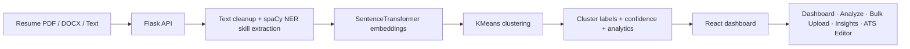

# SkillMap

<div align="center">

**AI-powered resume intelligence platform — clusters candidates by real skill signals and provides ATS resume optimization.**

[](https://react.dev/)
[](https://vitejs.dev/)
[](https://flask.palletsprojects.com/)
[](https://www.python.org/)

</div>

SkillMap turns a resume folder into a searchable talent map. Upload resumes, cluster them by skill embeddings, and optimize individual resumes for ATS compatibility — all from a single dashboard.

## Features

- **Skill Clustering** — Groups resumes into clusters using SentenceTransformer embeddings + KMeans.
- **Single Resume Analysis** — Predicts best-fit cluster with confidence scoring.
- **Bulk Screening** — Batch analysis for up to 50 resumes with CSV export.
- **Insights Dashboard** — Skill distributions, cluster analytics, and top-skill charts.
- **ATS Resume Editor** — Upload a resume, get an instant ATS compatibility score (0–100), domain detection, and actionable improvement suggestions. Edit inline with a split-view A4 preview.

## Architecture



## Screens

| Screen | Description |
|---|---|
| **Dashboard** | Cluster cards, top skills, high-level metrics |
| **Analyze** | Single-resume upload and cluster prediction |
| **Bulk Upload** | Batch processing with exportable results |
| **Insights** | Cluster and skill distribution charts |
| **ATS Editor** | Upload → Score → Edit → Export workflow |

## Tech Stack

### Backend
- Flask + Flask-CORS
- SentenceTransformers (BERT embeddings)
- scikit-learn (KMeans clustering)
- spaCy (NER-based skill extraction)
- pandas, NumPy, joblib
- pdfminer.six, python-docx (file parsing)

### Frontend
- React 18 + React Router
- Vite (build tool)
- Framer Motion (animations)
- Recharts (charts)
- Lucide React (icons)
- pdfjs-dist, mammoth (client-side file extraction)

### Model Artifacts
- `models/bert_model_name.pkl` — BERT model identifier
- `models/kmeans_model.pkl` — trained KMeans clustering model
- `models/cluster_names.pkl` — cluster label mapping
- `models/cluster_results.csv` — pre-computed cluster assignments

## Project Structure

```text
SkillMap/
├── backend/
│   ├── app.py              # Flask API (7 endpoints)
│   ├── ats_scorer.py        # Backend ATS scoring engine
│   ├── skills.py            # spaCy NLP skill extraction
│   ├── extractors.py        # PDF/DOCX text extraction
│   ├── train.py             # Model training script
│   └── requirements.txt
├── frontend/
│   ├── src/
│   │   ├── components/      # Reusable UI components
│   │   ├── pages/           # Route pages
│   │   ├── context/         # React context providers
│   │   ├── lib/             # Scoring engine + utilities
│   │   ├── data/            # Skill databases (JSON)
│   │   └── styles/          # ATS editor tokens
│   ├── index.html
│   └── package.json
├── models/                  # Trained ML artifacts
├── Resume.csv               # Training dataset
└── README.md
```

## Local Setup

### 1. Backend

```bash
python3 -m venv venv
source venv/bin/activate        # macOS/Linux
# venv\Scripts\activate         # Windows

pip install -r backend/requirements.txt
python3 -m spacy download en_core_web_sm
```

Start the API on port 5001:

```bash
FLASK_PORT=5001 python3 backend/app.py
```

### 2. Frontend

```bash
cd frontend
npm install
npm run dev
```

The app runs on `http://localhost:5173`.

### 3. Environment Variables

Copy `.env.example` to `.env` and adjust as needed:

```
FLASK_PORT=5001
FLASK_DEBUG=false
NUMBA_DISABLE_JIT=1
```

## API Reference

| Method | Route | Purpose |
|---|---|---|
| POST | `/predict` | Predict cluster for one resume |
| GET | `/clusters` | All clusters and metadata |
| POST | `/bulk-predict` | Batch cluster prediction (up to 50) |
| GET | `/stats` | Analytics, totals, top skills |
| GET | `/clusters/<id>/resumes` | Paginated resumes in a cluster |
| POST | `/ats/score` | ATS compatibility scoring (NLP-powered) |
| GET | `/health` | Health check with model status |

## Training

To retrain models on new data:

```bash
python3 backend/train.py
```

This reads `Resume.csv`, generates embeddings, runs KMeans, and saves artifacts to `models/`.

## Deployment Notes

- Backend must run on port **5001** (macOS reserves 5000 for AirPlay).
- Set `NUMBA_DISABLE_JIT=1` to avoid JIT errors on newer Python versions.
- For production, use Gunicorn: `gunicorn -w 1 --threads 2 --preload -b 0.0.0.0:5001 backend.app:app`
- The ATS editor works standalone (client-side scoring) if the backend is unavailable.

## Deployment

### Backend (Render)

1. Create a new **Web Service** on [Render](https://render.com)
2. Connect this GitHub repository
3. Configure:
   - **Root Directory:** `backend`
   - **Runtime:** Python 3
   - **Build Command:** `pip install torch==2.2.2+cpu --extra-index-url https://download.pytorch.org/whl/cpu && pip install -r requirements.txt && python -m spacy download en_core_web_sm`
   - **Start Command:** `gunicorn app:app --bind 0.0.0.0:$PORT --workers 1 --threads 2 --preload --timeout 120`
4. Add environment variables:
   - `NUMBA_DISABLE_JIT` = `1`
   - `MODEL_DIR` = `/opt/render/project/src/models`
5. Upload `Resume.csv` and model artifacts to the service (or use persistent disk)

### Frontend (Vercel)

1. Create a new project on [Vercel](https://vercel.com)
2. Connect this repository
3. Configure:
   - **Root Directory:** `frontend`
   - **Framework Preset:** Vite
   - **Build Command:** `npm run build`
   - **Output Directory:** `dist`
4. Add environment variable:
   - `VITE_API_URL` = `https://your-backend.onrender.com`
5. Deploy

### Frontend (Netlify — alternative)

1. Create a new site on [Netlify](https://netlify.com)
2. Connect this repository
3. Configure:
   - **Base directory:** `frontend`
   - **Build command:** `npm run build`
   - **Publish directory:** `frontend/dist`
4. Add environment variable:
   - `VITE_API_URL` = `https://your-backend.onrender.com`

> **Note:** Update the API base URL in `frontend/src/api/client.js` and `frontend/src/context/ResumeContext.jsx` to use `import.meta.env.VITE_API_URL` for production deployments.

## Data

`Resume.csv` (54 MB) is excluded from git due to GitHub's file size limit.

📥 **Download the dataset from Kaggle:**
[**Resume Dataset** by Gaurav Dutta](https://www.kaggle.com/datasets/gauravduttakiit/resume-dataset)

After downloading, place `Resume.csv` in the project root:

```text
SkillMap/
├── Resume.csv    ← place here
├── backend/
├── frontend/
└── models/
```
