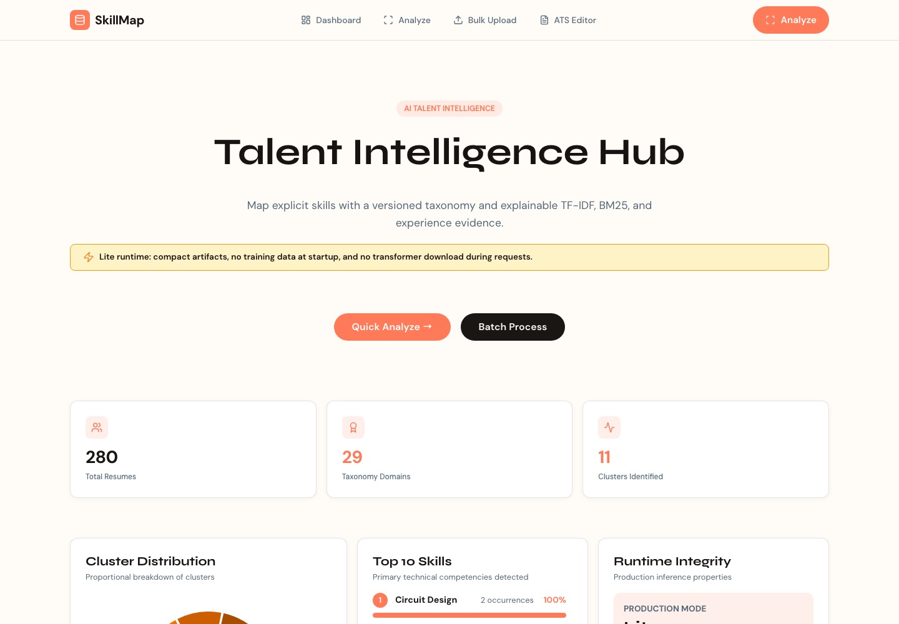
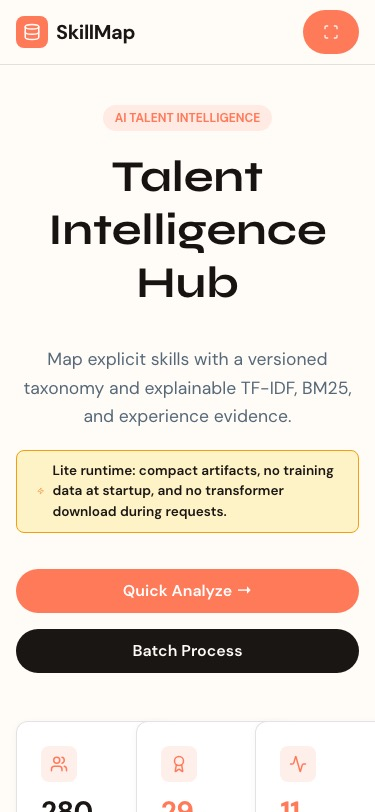
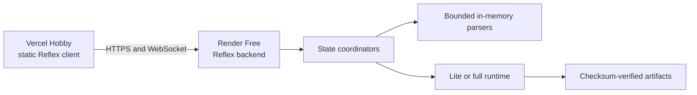

# SkillMap

SkillMap is an explainable talent-intelligence application for resume skill mapping,
job-description comparison, ATS feedback, and bounded batch analysis. It is built with
Reflex and defaults to a low-memory inference path suitable for a demonstration service.

SkillMap provides decision support. It does not make automatic hiring, rejection, or
employment decisions.

## Screenshots





The dashboard reports only values available from the compact runtime catalogue. Analysis
results identify the active scoring mode, artifact version, matched evidence, and missing
skills.

## Implemented features

- PDF, DOCX, and UTF-8 TXT resume parsing with file, archive, page, and text limits
- Taxonomy-based domain analysis with deterministic seniority evidence
- Explainable resume-to-job scoring using skill overlap, TF-IDF, BM25, and experience
- Optional locally provisioned sentence-transformer similarity in full mode
- ATS feedback, single analysis, and duplicate-aware batch analysis for up to 50 files
- Typed Pydantic result contracts and checksum-verified runtime artifacts
- Request IDs, safe user errors, structured metadata-only logs, and a readiness endpoint
- Responsive Reflex views with non-blocking cold-start and cancellation states

## Architecture


```mermaid
flowchart LR
    V[Vercel Hobby\nstatic Reflex client] -->|HTTPS and WebSocket| R[Render Free\nReflex backend]
    R --> S[State coordinators]
    S --> P[Bounded in-memory parsers]
    S --> M[Lite or full runtime]
    M --> A[Checksum-verified artifacts]
```

Reflex state events are the application API. The only additional FastAPI route is
`GET /health` for deployment readiness. There is no Flask service, database, object
storage, feature store, DVC service, or MLflow service in the runtime.

## Lite and full modes

`SKILLMAP_MODE=lite` is the default. It loads the compact files under `models/runtime/`
and uses taxonomy evidence, TF-IDF, BM25, and deterministic rules. It does not import
Torch, Transformers, UMAP, HDBSCAN, pandas, or the training CSV during startup.

`SKILLMAP_MODE=full` is an optional local or paid-infrastructure mode. Install
`requirements-ml.in` and provision a sentence-transformer directory at
`SKILLMAP_FULL_MODEL_PATH`. Full mode will not download a model from a live request. It
fails with a safe, explicit error when the dependency or local model is unavailable.

## Local installation

Python 3.12 is the supported production version.

```bash
git clone https://github.com/Deekshith06/SkillMap.git
cd SkillMap
python3.12 -m venv .venv
source .venv/bin/activate
python -m pip install --upgrade pip
python -m pip install -r requirements-runtime.txt
cp .env.example .env
reflex run
```

Open `http://localhost:3000`; the backend listens on `http://localhost:8000`.

## Environment variables

| Variable | Default | Purpose |
| --- | --- | --- |
| `SKILLMAP_MODE` | `lite` | Select `lite` or `full` inference |
| `API_URL` | `http://localhost:8000` | Backend URL baked into the Reflex client |
| `DEPLOY_URL` | `http://localhost:3000` | Public frontend origin |
| `CORS_ALLOWED_ORIGINS` | `http://localhost:3000` | Comma-separated exact frontend origins |
| `MAX_RESUME_SIZE_MB` | `2` | Per-document upload limit |
| `MAX_BATCH_SIZE_MB` | `10` | Total accepted batch size |
| `MAX_EXTRACTED_TEXT_CHARS` | `100000` | Post-parse text limit |
| `MAX_PDF_PAGES` | `20` | PDF page limit |
| `PARSER_TIMEOUT_SECONDS` | `10` | Parser timeout |
| `LOG_LEVEL` | `INFO` | Structured logging threshold |
| `SKILLMAP_ARTIFACT_DIR` | `models/runtime` | Lite artifact directory |
| `SKILLMAP_FULL_MODEL_PATH` | `models/full/all-MiniLM-L6-v2` | Local full-mode model |

Origins must be absolute HTTP(S) origins. Wildcards and origins containing paths are
rejected. Do not put secrets in Vercel client environment variables.

## Development commands

```bash
python -m pip install -r requirements-dev.in
ruff check .
ruff format --check .
mypy skillmap
pytest -q
bandit -r skillmap -c pyproject.toml
pip-audit -r requirements-runtime.txt
```

`requirements-runtime.in` is the direct production dependency specification and
`requirements-runtime.txt` is the authoritative transitive lock. Regenerate it with:

```bash
uv pip compile requirements-runtime.in -o requirements-runtime.txt
```

## Training and artifact export

The normal export is lightweight and reads the training CSV only from the offline script:

```bash
python train_model.py
```

This creates `model_manifest.json`, the safe aggregate cluster catalogue, taxonomy, TF-IDF
vectorizer, and classifier in `models/runtime/`. The manifest contains SHA-256 checksums.
No resume body is written to the runtime catalogue.

### Accuracy-first training pipeline

The offline `training/` package adds licensed-dataset registration, typed PII masking,
SkillSpan conversion, ESCO/O*NET preparation, MinHash/LSH deduplication before grouped
splitting, deterministic taxonomy-backed augmentation, hard negatives, compact and neural
candidate lanes, calibration, ablations, active learning, error analysis, candidate-only
export, and promotion gates.

```bash
python -m training.pipeline --config configs/training/smoke_test.yaml
python -m training.pipeline --config configs/training/accuracy_first.yaml
```

The measured smoke run is synthetic only and did not promote a model. The existing lite
runtime remains production because no immutable real gold test or outcome fairness
evaluation exists. See [Datasets](docs/DATASETS.md), [Training](docs/TRAINING.md), and
[Evaluation](docs/EVALUATION.md); do not report smoke metrics as real-world accuracy.

For optional full experiments:

```bash
python -m pip install -r requirements-ml.in
python train_model.py --full
```

Full training may download the configured open-source embedding model and runs only in an
offline development environment. pandas, Torch, sentence-transformers, UMAP, HDBSCAN, and
matplotlib are not Render runtime dependencies.

## Render deployment

1. Create a Render Blueprint from this repository; `render.yaml` defines one free Python
   web service in Singapore.
2. Replace `API_URL` with the assigned Render HTTPS URL.
3. Set `DEPLOY_URL` and `CORS_ALLOWED_ORIGINS` to the exact Vercel production URL.
4. Deploy and verify `https://<service>.onrender.com/health` returns `status: ready`.

The service installs `requirements-runtime.txt` and runs:

```bash
reflex run --env prod --backend-only --backend-host 0.0.0.0 --backend-port $PORT
```

It uses no persistent disk. Free Render services can sleep after inactivity, so the UI
shows a reconnecting state rather than fake progress.

## Vercel deployment

1. Import the repository into Vercel as an unrecognized framework project.
2. Set `API_URL` to the Render HTTPS URL.
3. Set `DEPLOY_URL` and `CORS_ALLOWED_ORIGINS` to the Vercel production URL.
4. Deploy using `vercel.json`.

Vercel installs only `requirements-frontend.txt`, runs
`reflex export --frontend-only --no-zip`, and publishes `.web/build/client`. It never
starts or deploys the Python backend. After either public URL changes, update both
projects and redeploy the frontend because `API_URL` is a build-time setting.

## Free-tier limitations

- The Render backend may need time to wake after inactivity.
- In-memory state and uploads are lost on restart and are not shared across instances.
- The service is intended for demonstrations and small batches, not high-throughput ATS
  processing.
- The included catalogue is an aggregate of a small research dataset and is not an
  employment-market benchmark.
- Full semantic mode is outside the Render Free memory target.

## Security and privacy

Uploads are read in 64 KiB chunks, bounded before parsing, processed in memory, and closed
after use. PDFs have encryption and page checks. DOCX archives reject traversal, symlinks,
macros, excessive entries, and excessive expansion. Raw parser errors are never returned
to users. Logs contain operational metadata only and never resume or job text.

Direct email addresses, phone numbers, and URLs are removed before matching. The scoring
taxonomy does not contain name, gender, photograph, age, nationality, address, religion,
or marital-status features. See [Privacy](docs/PRIVACY.md) and
[Responsible AI](docs/RESPONSIBLE_AI.md).

## Responsible AI

SkillMap results require human review. Scores describe evidence overlap with supplied text,
not candidate quality, future performance, identity, or eligibility. Do not use SkillMap
as the sole basis for hiring or rejection. Model details are in
[the model card](docs/MODEL_CARD.md).

## Testing

Tests are grouped into `tests/unit`, `tests/integration`, `tests/security`, and
`tests/evaluation`. Fixtures are generated and contain no real resumes.

```bash
pytest -q
reflex export --frontend-only --no-zip
SKILLMAP_MODE=lite reflex run
```

## Troubleshooting

- `status: not_ready`: run `python train_model.py`, then verify checksums in the manifest.
- `Full ML mode is not installed`: install ML dependencies and provision the local model
  directory, or set `SKILLMAP_MODE=lite`.
- Browser cannot connect: verify `API_URL`, exact CORS origin, HTTPS, and Render health.
- Upload rejected: use a valid PDF, DOCX, or UTF-8 TXT file under 2 MB and within page/text
  limits. Macro-enabled Office files are intentionally unsupported.

## Project structure

```text
skillmap/
  adapters/      Artifact loading and secure document parsing
  config/        Typed environment settings and structured logging
  domain/        Pydantic contracts, taxonomy, and scoring
  ml_runtime/    Explicit lite and optional full inference engines
  services/      Resume, analysis, matching, and reporting operations
  state/         Reflex workflow coordination
  pages/         Reflex page composition
  components/    Reusable interface components
models/runtime/  Compact versioned production artifacts
tests/           Unit, integration, security, and evaluation checks
```

## Contributing

1. Create a focused branch.
2. Add tests for behavior changes.
3. Run the development commands and frontend export.
4. Do not commit resumes, private data, secrets, generated caches, or full-mode models.
5. Open a pull request describing behavior and deployment impact.

CI runs lint, formatting, typing, tests, Bandit, pip-audit, and a static Reflex export on
pushes and pull requests to `main`.

## License

SkillMap is available under the [MIT License](LICENSE).
