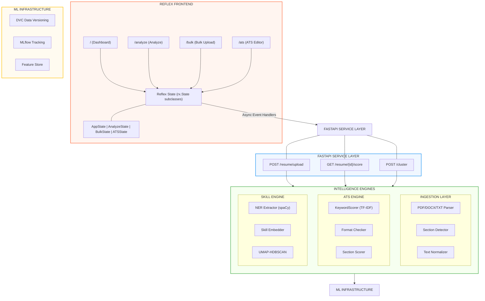

# 🗺️ SkillMap

### **AI-Powered Talent Intelligence & Skill Mapping Engine**

[](https://www.python.org/)
[](https://reflex.dev/)
[](https://pandas.pydata.org/)
[](https://opensource.org/licenses/MIT)

---

## 🔭 Overview

**SkillMap** is a modern, high-fidelity talent intelligence platform designed to bridge the gap between raw resume data and actionable professional insights. By leveraging state-of-the-art transformer embeddings and unsupervised clustering techniques (UMAP/HDBSCAN), SkillMap automatically categorizes talent into granular professional domains, providing recruiters and hiring managers with a bird's-eye view of their talent pool.

Built with a focus on visual excellence and data-driven precision, SkillMap transforms static resumes into a dynamic, interactive "Skill Map" that highlights core competencies, domain clusters, and career trajectories.

---

## ⚙️ How It Works

SkillMap operates as a multi-layered intelligence system. Below is the end-to-end technical architecture and data flow:


```mermaid
graph TD
    subgraph Frontend ["REFLEX FRONTEND"]
        direction TB
        P1["/ (Dashboard)"]
        P2["/analyze (Analyze)"]
        P3["/bulk (Bulk Upload)"]
        P4["/ats (ATS Editor)"]
        
        State["Reflex State (rx.State subclasses)"]
        StateData["AppState | AnalyzeState | BulkState | ATSState"]
        
        P1 & P2 & P3 & P4 --> State
        State --- StateData
    end

    State -->|"Async Event Handlers"| Service["FASTAPI SERVICE LAYER"]

    subgraph ServiceLayer ["FASTAPI SERVICE LAYER"]
        direction LR
        S1["POST /resume/upload"]
        S2["GET /resume/{id}/score"]
        S3["POST /cluster"]
    end

    Service --- S1 & S2 & S3
    S1 & S2 & S3 --> Engine

    subgraph Engine ["INTELLIGENCE ENGINES"]
        direction TB
        subgraph Ingestion ["INGESTION LAYER"]
            I1["PDF/DOCX/TXT Parser"]
            I2["Section Detector"]
            I3["Text Normalizer"]
        end
        
        subgraph ATS ["ATS ENGINE"]
            A1["KeywordScorer (TF-IDF)"]
            A2["Format Checker"]
            A3["Section Scorer"]
        end
        
        subgraph Skill ["SKILL ENGINE"]
            K1["NER Extractor (spaCy)"]
            K2["Skill Embedder"]
            K3["UMAP-HDBSCAN"]
        end
    end

    Engine --> Infra["ML INFRASTRUCTURE"]

    subgraph InfraLayer ["ML INFRASTRUCTURE"]
        direction LR
        M1["DVC Data Versioning"]
        M2["MLflow Tracking"]
        M3["Feature Store"]
    end

    %% Styling
    style Frontend fill:#fff5f0,stroke:#ff7043,stroke-width:2px
    style ServiceLayer fill:#f0f7ff,stroke:#2196f3,stroke-width:2px
    style Engine fill:#f6fff0,stroke:#4caf50,stroke-width:2px
    style InfraLayer fill:#fffbf0,stroke:#ffc107,stroke-width:2px
```

---

## 🚀 Key Features

*   **🧬 Intelligent Domain Clustering**: Automatically groups resumes into professional clusters using advanced NLP and machine learning pipelines.
*   **📊 Talent Intelligence Dashboard**: A premium, high-fidelity interface for visualizing talent distribution and top-tier skill metrics.
*   **📝 ATS Optimization**: A specialized editor to analyze and align resume content with specific job descriptions for maximum compatibility.
*   **⚡ Real-time Analysis**: Instant feedback loops for individual resume uploads or job description comparisons.
*   **📦 Bulk Ingestion Pipeline**: Efficiently process and categorize large-scale resume datasets (CSV/PDF/DOCX support).
*   **🎨 Premium UI/UX**: A "Cocoa & Amber" inspired design system built on the Reflex framework for a smooth, SaaS-like experience.

---

## 🛠️ Tech Stack

SkillMap is engineered using a robust stack of modern data science and web technologies:

| Category | Tools |
| :--- | :--- |
| **Core Language** | Python 3.9+ |
| **Web Framework** | Reflex (Full-stack Python Web) |
| **Data Orchestration** | Pandas, NumPy |
| **Machine Learning** | Scikit-learn, UMAP-learn, HDBSCAN |
| **NLP & LLM** | Sentence-Transformers, Spacy, HuggingFace |
| **Visualization** | Recharts, Plotly, Lucide Icons |
| **Database/Storage** | SQLAlchemy, Local File System |

---

## ⚙️ Installation & Setup

Ensure you have Python 3.9 or higher installed on your system.

1.  **Clone the Repository**
    ```bash
    git clone https://github.com/Deekshith06/SkillMap.git
    cd SkillMap
    ```

2.  **Initialize Virtual Environment**
    ```bash
    python3 -m venv venv
    source venv/bin/activate  # On Windows: venv\Scripts\activate
    ```

3.  **Install Dependencies**
    ```bash
    pip install -r requirements.txt
    ```

4.  **Initialize & Run Application**
    ```bash
    reflex init
    reflex run
    ```

---

## 📖 Usage

SkillMap provides both a web interface and a modular backend for data processing.

### **Python Integration (Data Pipeline)**
You can use the core mapping logic within your own data pipelines:

```python
import pandas as pd
from skillmap.ml.pipeline import SkillAnalyzer

# Load candidate data
df = pd.read_csv("candidates.csv")

# Initialize the analyzer
analyzer = SkillAnalyzer(model_path="models/v1")

# Generate skill clusters and embeddings
df_processed = analyzer.process_dataframe(
    df, 
    text_column="resume_text",
    target_column="domain_cluster"
)

# Preview the intelligence mapping
print(df_processed[['candidate_name', 'domain_cluster', 'top_skills']].head())
```

---

## 📁 Project Structure

```text
SkillMap/
├── skillmap/               # Main application package
│   ├── components/         # Reusable UI components (Nav, Sidebar, Charts)
│   ├── core/               # App configuration and state management
│   ├── ml/                 # Machine learning models and NLP pipelines
│   ├── pages/              # Reflex page definitions (Dashboard, Analyze, ATS)
│   ├── styles/             # CSS and Design System tokens
│   └── skillmap.py         # App entry point
├── assets/                 # Static assets (images, fonts, custom CSS)
├── data/                   # Raw and processed datasets
├── models/                 # Serialized ML models and embeddings
├── rxconfig.py             # Reflex configuration file
├── requirements.txt        # Project dependencies
└── README.md               # Documentation
```

---

## 🐼 Data Structures & Pandas Usage

The core of SkillMap's intelligence relies on sophisticated `pandas` transformations to handle multi-dimensional talent data.

*   **Grouping & Aggregation**: We use `.groupby()` to calculate skill density across different professional clusters and experience levels.
*   **Vectorized Text Processing**: Applying NLP transformations efficiently across large DataFrames to extract keywords and entities.
*   **Feature Normalization**: Using pandas for scaling and transforming numerical skill scores before clustering.
*   **Data Validation**: Strict filtering and cleaning of resume data to ensure high-fidelity analytical outputs.

---

## 🏛️ Architecture & Philosophy

SkillMap is built on a modular, 4-layered architecture designed for high performance, maintainability, and scalability:

1.  **Reflex Frontend**: A state-driven UI composed of specialized modules for uploading, scoring, and clustering. It utilizes `rx.State` subclasses to manage asynchronous event handlers and real-time updates.
2.  **FastAPI Service Layer**: Acts as the central orchestrator, providing RESTful endpoints for resume ingestion, scoring, and clustering requests.
3.  **Intelligence Engines**:
    *   **ATS Engine**: Implements specialized keyword and section scoring using TF-IDF and BM25.
    *   **Skill Engine**: Handles NER extraction, transformer-based embeddings (all-MiniLM-L6-v2), and unsupervised clustering (UMAP-HDBSCAN).
4.  **ML Infrastructure**: A robust backbone using **DVC** for data versioning, **MLflow** for experiment tracking and model registry, and a **Feature Store** for caching embeddings and cluster results.

---

## 🤝 Contributing

Contributions are what make the open-source community such an amazing place to learn, inspire, and create.

1.  **Fork** the Project
2.  Create your **Feature Branch** (`git checkout -b feature/AmazingFeature`)
3.  **Commit** your Changes (`git commit -m 'Add some AmazingFeature'`)
4.  **Push** to the Branch (`git push origin feature/AmazingFeature`)
5.  Open a **Pull Request**

---

## 📜 License

Distributed under the MIT License. See `LICENSE` for more information.

---

## 🔮 Future Enhancements

*   **🌐 Multi-Language Support**: Expanding NLP pipelines to support non-English resumes.
*   **🤖 LLM-Powered Feedback**: Integrating GPT-4/Claude for personalized resume improvement suggestions.
*   **📈 Historical Trend Analysis**: Tracking skill demand shifts over time within the dashboard.
*   **🔗 LinkedIn Integration**: Automated profile ingestion and synchronization.
